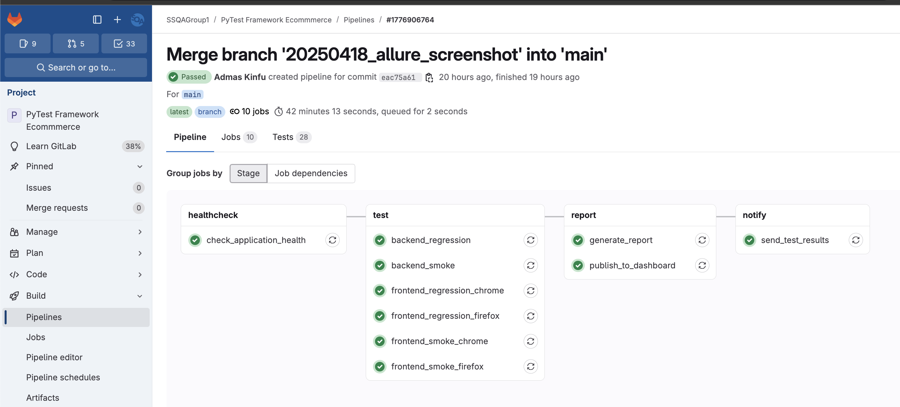
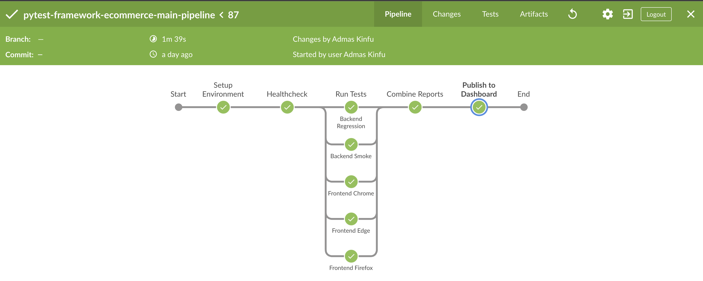
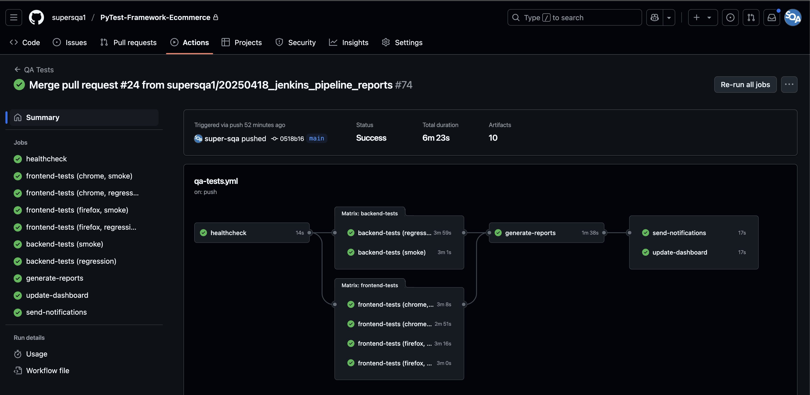
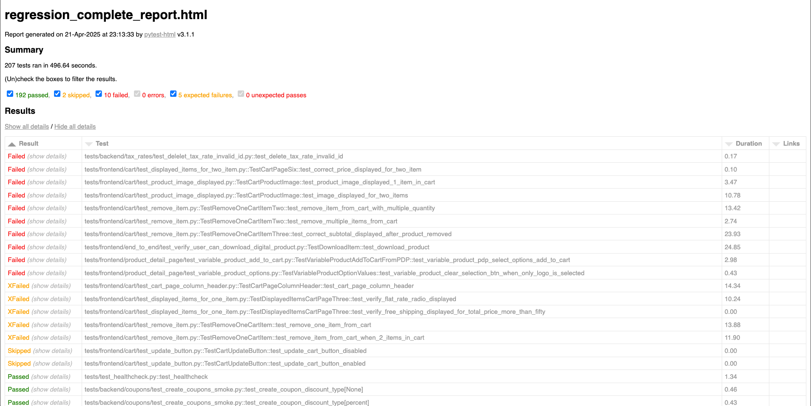
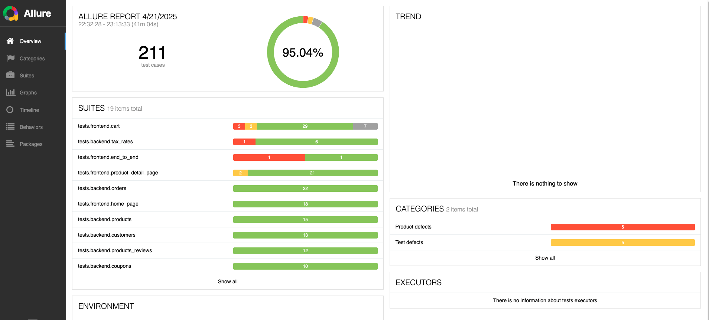
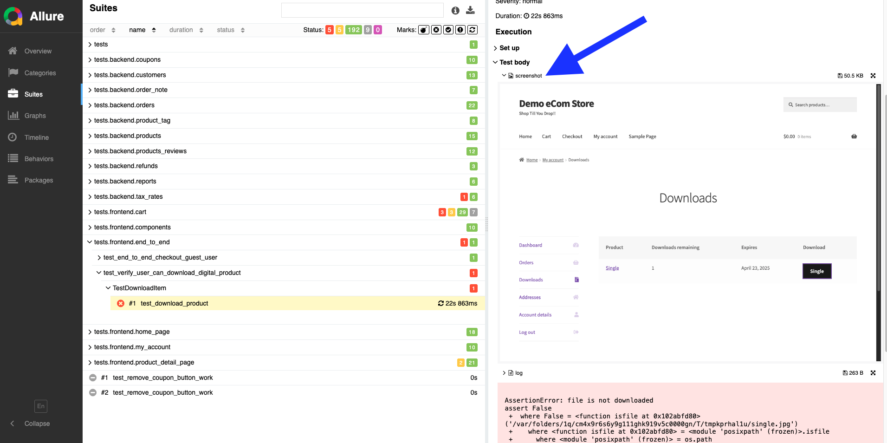
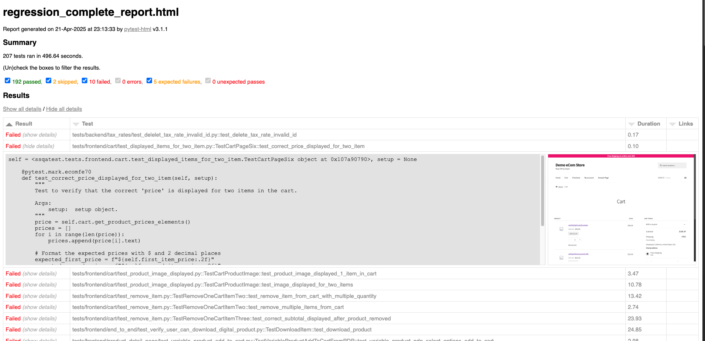
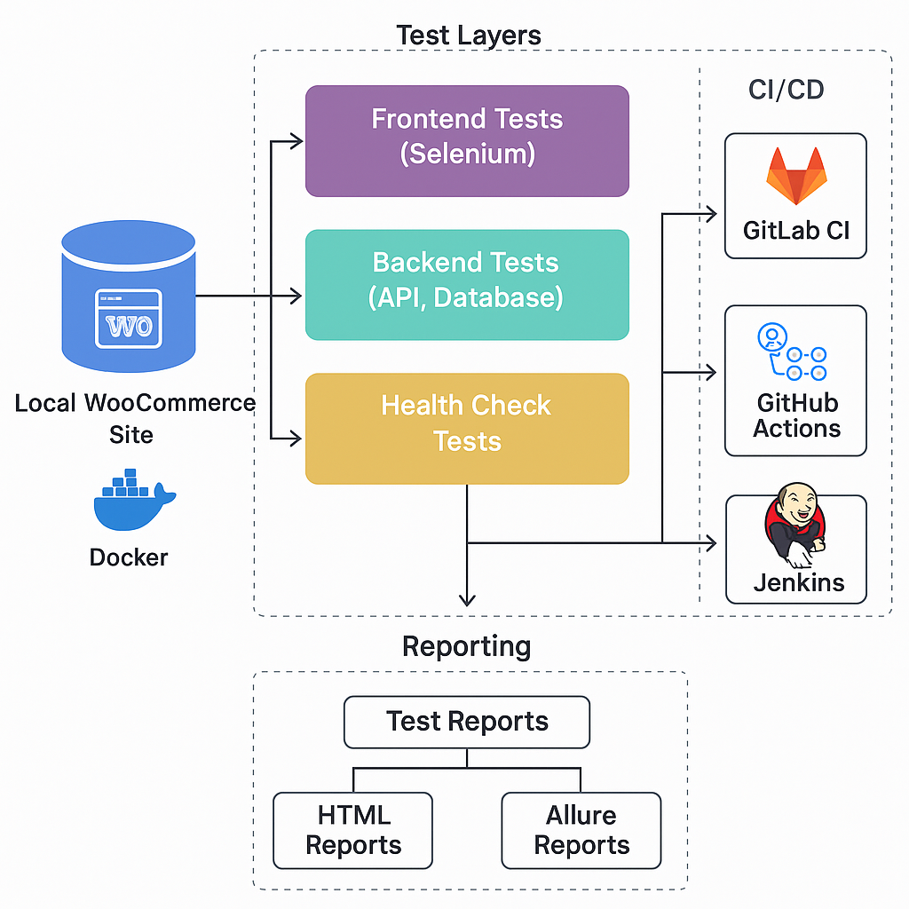

# QA Automation Framework for Demo Ecommerce Store 🚀

<div align="center">
  
  
  
  
  
</div>


## ✨ Highlights

- 100+ automated tests across frontend, API, and database
- CI/CD ready: GitLab CI, GitHub Actions, Jenkins
- HTML, JUnit, and Allure reporting with screenshots on failure
- Developed as part of QA Automation portfolio projects

## 📋 Overview
A professional-grade test automation framework designed for the **Demo Ecommerce Store** built with WordPress and WooCommerce. It covers frontend (using Selenium), API, and database testing using Python and PyTest, and integrates with CI/CD systems like GitHub Actions, Jenkins, and GitLab CI.

> **Example Site:** [Demo Ecommerce Store](http://dev.bootcamp.store.supersqa.com/)

### 🎯 Key Features
- **Comprehensive Test Coverage**: Frontend, backend, and database layers
- **Advanced Reporting**: 
  - HTML reports with detailed test execution information
  - Allure reports with dashboards and analytics
  - Automatic screenshot capture on test failures
- **CI/CD Integration**: 
  - Jenkins pipeline setup
  - GitHub Actions workflow
  - GitLab CI configuration
- **End-to-End Testing**: Comprehensive coverage for frontend and backend
- **API Testing**: Robust test suite for WooCommerce endpoints
- **Database Testing**: MySQL integration for data validation
- **Cross-Browser Support**: Test execution across multiple browsers
- **Docker Support**: Containerized test execution environment

## 📸 Project Screenshots

### CI/CD Pipelines
<div align="center">
  
  <p><em>GitLab CI pipeline showing parallel test execution and stages</em></p>
  
  
  <p><em>Jenkins pipeline running tests and publishing reports</em></p>
  
  
  <p><em>GitHub Actions workflow execution</em></p>
</div>

### Test Reports
<div align="center">
  
  <p><em>HTML test report with detailed execution information</em></p>
  
  
  <p><em>Allure Report Dashboard showing test execution overview</em></p>
  
  
  <p><em>Automatically captured screenshot on test failure (Allure)</em></p>

  
  <p><em>Automatically captured screenshot on test failure (pytest-html)</em></p>
</div>

## 🛠️ Technical Stack
- **Programming Language**: Python 3.13+
- **Testing Framework**: PyTest
- **Web Automation**: Selenium WebDriver
- **API Testing**: Requests library
- **Database**: MySQL
- **Containerization**: Docker
- **CI/CD**: GitLab CI, Jenkins, GitHub Actions

## 🧱 Architecture Overview

The framework follows a modular architecture with a clear separation between test layers and utility logic. Tests are structured using the Page Object Model for frontend coverage, helper modules for API and database testing, and configuration files to support multiple environments.

The automation flow involves:
- Selenium-based UI tests interacting with a live WooCommerce frontend
- REST API tests targeting WooCommerce endpoints
- MySQL integration to verify backend data consistency
- CI/CD pipelines (Jenkins, GitLab CI, GitHub Actions) automatically triggering tests and publishing reports
- Allure and HTML reporting for detailed visibility

<p align="center">
  
  <br><em>Overall architecture showing test layers, CI triggers, and reporting flow</em>
</p>

## 🚀 Getting Started

### Prerequisites
- Python 3.13 or higher
- Docker (optional, for containerized execution)
- Access to the **Demo Ecommerce Store** site
- MySQL database access

### Quick Start
1. Clone the repository:
```bash
git clone git@github.com:milenagrabovskiy/Ecommerce-Pytest-Framework.git
cd Ecommerce-Pytest-Framework
